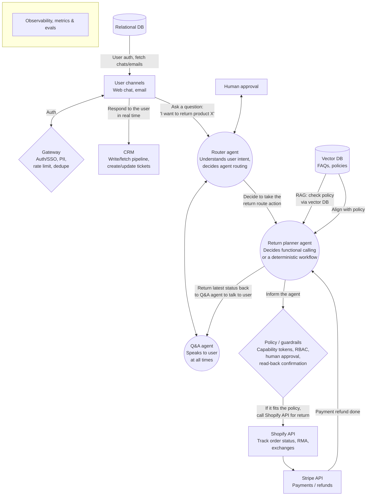

# How to design an AI agent system for e-commerce DTC customer support

**Scope:** Returns, exchanges, WISMO (where-is-my-order)

## Goals
- ≥70% automation
- CSAT > 4.5/5
- p50 < 1s, p95 < 2.5s

## Rules
- Return window: <30 days only, item must be returned in good condition
- Refund policy: <$50 auto-approved, ≥$50 requires manager approval
- Exchange policy: good condition only, within eligible product categories
- Route to human: when asked by the user, or on emotion detection

## Backend / DB
- Sized for peak RPS and seasonality
- Data storage: relational DB

## Architecture

*A few arrow labels were inferred where the handwriting was small or cut off in the source frame — flag anything that should read differently.*
